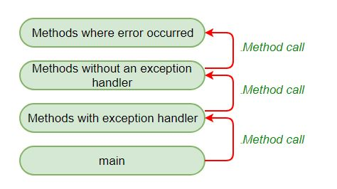

# TIPS JAVA

## División por 0

### Divides un double/float por 0

``` Java
    double p = 1;
    System.out.println(p/0);
```

En este caso el output es *Infinity*.

### Divides un entero por 0

``` Java
    int p = 1;
    System.out.println(p/0);
    // output
    // Exception in thread "main" java.lang.ArithmeticException: / by zero

```

## Excepciones checked vs unchecked

### Checked(marcadas)

Son las excepciones que son marcadas en tiempo de compilación. Si algún código lanza una excepción marcada, entonces el método debe manejar la excepción o debe especificar la excepción con la keyword throws.

```Java
import java.io.*;

class Main {
	public static void main(String[] args) {
		FileReader file = new FileReader("C:\\test\\a.txt");
		BufferedReader fileInput = new BufferedReader(file);
		
		for (int counter = 0; counter < 3; counter++)
			System.out.println(fileInput.readLine());
		
		fileInput.close();
	}
}

/*
Exception in thread "main" java.lang.RuntimeException: Uncompilable source code -
unreported exception java.io.FileNotFoundException; must be caught or declared to be
thrown
    at Main.main(Main.java:5)
*/

```

Para arreglar esto hay que usar throws o un bloque try catch.

### Unchecked(sin marcar)

Son excepciones no marcadas en tiempo de ejecución. Depende de los programdores espcificarla o capturarlas. En Java, las excepciones sin marcar son Error y RuntimeException. Todo lo relacionado con Throwable está marcado.

#### Ejemplo

```Java
class Main {
public static void main(String args[]) {
	int x = 0;
	int y = 10;
	int z = y/x;

}

/*
Exception in thread "main" java.lang.ArithmeticException: / by zero
    at Main.main(Main.java:5)
Java Result: 1
*/

```

## Propagación de excepciones en Java

Primero se lanza una excepción desde la parte superior del stack y, si no se detecta, baja el stack al método anterior. Después de que un método lanza una excepción, el sistema en tiempo de ejecución intenta encontrar algo para manejarlo. El conjunto de posibles "cosas" para manejar la excepción es la lista ordenada de métodos que se han llamado para llegar al método dónde ocurrió el error. La lista de métodos se conoce como *call stack*, y el método de búsqueda es la *propagación de excepciones*.



### Propagación de excepciones en excepciones unchecked

Cuando se origina una excepción, la propagación es el proceso por el cuál la excepción pasa de arriba del stack a abajo. Si no da con la excepción la primera vez, vuelve a bajar al método anterior y así sucesivamente hasta que la captura o hasta que llega al fondo del stack de llamadas(call stack). A esto se le llama la propagación de excepciones y ocurre en el caso de las excepciones unchecked.


```Java
// Java program to illustrate 
// unchecked exception propagation 
// without using throws keyword 
class Simple { 
	void m() 
	{ 
		int data = 50 / 0; // unchecked exception occurred 
		// exception propagated to n() 
	} 

	void n() 
	{ 
		m(); 
		// exception propagated to p() 
	} 

	void p() 
	{ 
		try { 
			n(); // exception handled 
		} 
		catch (Exception e) { 
			System.out.println("Exception handled"); 
		} 
	} 

	public static void main(String args[]) 
	{ 
		Simple obj = new Simple(); 
		obj.p(); 
		System.out.println("Normal flow..."); 
	} 
} 

```

### Propagación de excepciones en excepciones checked

En este caso no se produce la propagación de excepciones y es obligatoria el uso de la keyword throw. Sólo se propagan las excepciones unchecked. Las excepciones checked lanzan un error de compilación.

A diferencia de las excepciones unchecked, las checked no se puedne propagar sin utilizar *throw*.

```Java
// Java program to illustrate exception propagation 
// in checked exceptions and it can be propagated 
// by throws keyword ONLY 
import java.io.IOException; 
class Simple { 

	// exception propagated to n() 
	void m() throws IOException 
	{ 
		// checked exception occurred 
		throw new IOException("device error"); 
	} 

	// exception propagated to p() 
	void n() throws IOException 
	{ 
		m(); 
	} 
	void p() 
	{ 
		try { 

			// exception handled 
			n(); 
		} 
		catch (Exception e) { 
			System.out.println("exception handled"); 
		} 
	} 

	public static void main(String args[]) 
	{ 
		Simple obj = new Simple(); 
		obj.p(); 
		System.out.println("normal flow..."); 
	} 
} 

```